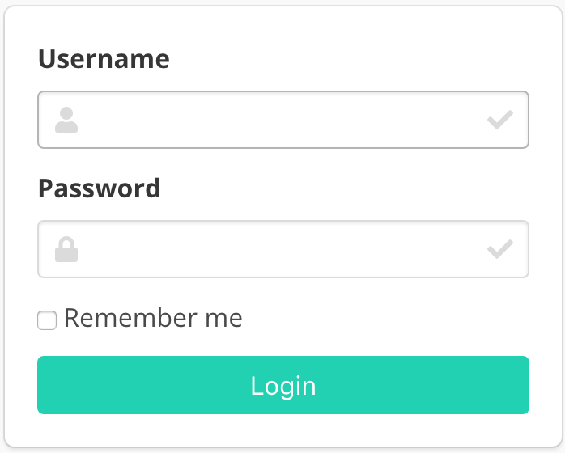

# AIHR Pro-Label
Text annotation tool. Annotation features for text classification, sequence labeling and sequence to sequence. Create labeled data for sentiment analysis, classification models, named entity recognition, and text summarization. 

### Named entity recognition

First demo is one of the sequence labeling tasks, named-entity recognition. You just select text spans and annotate it. Since doccano supports shortcut key, so you can quickly annotate text spans.


### Doc Classification / Doc Sentiment

Second demo is one of the text classification tasks, topic classification. Since there may be more than one category, you can annotate multi-labels.


### Machine translation

Final demo is one of the sequence to sequence tasks, machine translation. Since there may be more than one responses in sequence to sequence tasks, you can create multi responses.

## Features

-   Collaborative annotation
-   Create (import) and export datasets
-   View annotation progress statistics

## Requirements

-   Python 3.6+
-   Django 2.1.7+
-   Node.js 8.0+

## Installation

**Option 1: Pull the production Docker image**

```bash
docker pull quinnpertuit/prolabel
```
**Option 2: Setup Python environment**

Install the dependencies. Run the following commands:

```bash
sudo apt-get install libpq-dev
pip install -r requirements.txt
cd app
```

Next, start the webpack server so that the frontend gets compiled continuously.
Run the following commands in a new shell:

```bash
cd server/static
npm install
npm run build
# npm start  # for developers
cd ..
```

**Option 3: Pull the development Docker-Compose images**

```bash
docker-compose pull
```

## Usage

### Start the development server

#### Option 1: Running the Docker image as a Container

Run a Docker container:

```bash
docker run -d --rm --name prolabel \
  -e "ADMIN_USERNAME=admin" \
  -e "ADMIN_EMAIL=admin@example.com" \
  -e "ADMIN_PASSWORD=password" \
  -p 8000:8000 quinnpertuit1/prolabel
```

#### Option 2: Running Django development server

Before running, make the migration. Run the following command:

```bash
python manage.py migrate
```

Create admin user. Run the following command:

```bash
python manage.py create_admin --noinput --username "admin" --email "admin@example.com" --password "password"
```

Developers can also validate that the project by running the tests:

```bash
python manage.py test server.tests
```

Finally, to start the server, run the following command:

```bash
python manage.py runserver
```

Optionally, you can change the bind ip and port using the command

```bash
python manage.py runserver <ip>:<port>
```

#### Option 3: Running the development Docker-Compose stack

We can use docker-compose to set up the webpack server, django server, database, etc. all in one command:

```bash
docker-compose up
```

Now, open a Web browser and go to <http://127.0.0.1:8000/login/>. You should see the login screen:



### Create a project

Log in with the superuser account. 

Chose project type (classification, entity, or sequence-to-sequence.

### Import Data

After creating a project, you will see the "Import Data" page, or click `Import Data` button in the navigation bar. 

You can upload the following types of files (depending on project type):

-   `Text file`: file must contain one sentence/document per line separated by new lines.
-   `CSV file`: file must contain a header with `"text"` as the first column or be one-column csv file. If using labels the sencond column must be the labels.
-   `Excel file`: file must contain a header with `"text"` as the first column or be one-column excel file. If using labels the sencond column must be the labels. Supports multiple sheets as long as format is the same.
-   `JSON file`: each line contains a JSON object with a `text` key. JSON format supports line breaks rendering.

> Notice: Pro-Label won't render line breaks in annotation page for sequence labeling task due to the indent problem, but the exported JSON file still contains line breaks.

Any other columns (for csv/excel) or keys (for json) are preserved and will be exported in the `metadata` column or key as is.

Once you select a TXT/JSON file on your computer, click `Upload dataset` button. After uploading the dataset file, we will see the `Dataset` page (or click `Dataset` button list in the left bar). This page displays all the documents we uploaded in one project.

### Define labels

Click `Labels` button in left bar to define your own labels. You should see the label editor page. In label editor page, you can create labels by specifying label text, shortcut key, background color and text color.


### Annotation

Now, you are ready to annotate the texts. Just click the `Annotate Data` button in the navigation bar, you can start to annotate the documents you uploaded.

### Export Data

After the annotation is complete (partially or in full), you can download the annotated data. Click the `Edit data` button in navigation bar, and then click `Export Data`.

You can export data as CSV file or JSON file by clicking the button. 

Each exported document will have metadata column or key, which will contain
additional columns or keys from the imported document. The primary use-case for metadata is to allow you to match exported data with other system
by adding `external_id` to the imported file. For example:

Input file may look like this:
`import.json`

```JSON
{"text": "Working for IBM as a senior software entineer.", "meta": {"external_id": 1}}
```

and the exported file will look like this:
`output.json`

```JSON
{"doc_id": 2023, "text": "Designing autonomous systems for Skunkworks", "labels": ["Autonomy"], "username": "root", "meta": {"external_id": 1}}
```
